```{r setup, include=F}
library(tidyverse)
library(knitr)
library(glue)
library(emo)

knitr::opts_chunk$set(
  echo = FALSE,
  message = FALSE,
  warning = FALSE,
  fig.width = 6,
  fig.height = 5,
  fig.align='center',
  # cache = TRUE
  cache = FALSE
  )

# pagedown::chrome_print('Sessions/01-Intro/Slides/01-01-Intro.html')

# Machines
# t3.medium
```


```{r functions, include=F}
emoji <- function(keyword){
  candidates <- emo::ji_keyword[[keyword]]
  name <- candidates[1]
  return(emo::ji_name[[name]])
}
```


class: clear, no_number, title-slide
background-image: url(templates/KNBS_title.png)
background-size: cover

# <br> KENYA AFFORDABLE HOUSING DATA PROJECT <br> <em> Developing indicator metadata </em>

---
class: clear, agenda

<!-- # 1) About Course <br> 2) Understanding Data Science Teams <br> 3) Software Requirements <br> 4) Something <br> 5) Something <br> 6) Something -->
# 1) About this workshop <br> 2) Overview of the data pipeline <br> 3) Developing indicator metadata <br> 4) Automating indicator population

---
class: clear, no_number, transition

# About this workshop

---
class: .large
# What this workshop aims to achieve

* Develop sufficiently detailed indicator metadata 
> **Why do we need metadata? What distinguishes good metadata from bad? How should I go about developing my own metadata? This workshop will help participants to navigate some of the core uncertainties of the modern data pipeline**

* Familiarization with the downstream data pipeline
> **Developing metadata and collection templates is only the first stage of the data pipeline. The last part of the workshop considers what happens next and the skills required to move further down the data pipeline**

---
class: .large

# Key outcomes

.pull-left[

Following the workshop, we want the KNBS team to

* Develop and finalize the metadata for the **priority** KNBS indicators

* Collect the data for the **priority** KNBS indicators

* Continue working on the metadata and data collection for the remaining KNBS indicators

* Start to feel comfortable about revising/updating/appending metadata going forward
]

<!-- We also encourage the following behaviour when it comes to completing the exercises: -->
.pull-right[
***PLEASE***:

* Ask questions, we've been down this road before! `r emoji("nerd")`
  
* Metadata may not be the most exciting thing in the world but future you says thanks!


<!--  -->

]

---
class: .large

# Asking for assistance
.pull-left[
<br>
<br>

]

.pull-right[
<br>
<br>
* Please raise your `r emoji("raised_hand")`  if you have a question and we'll get to you as soon as we can

* The `r emoji("bubble")` is also being monitored for questions and the session will be recorded

* Please remain `r emoji("shushing_face")` when not asking a question
]

<!--  -->

---
class: clear, no_number, transition, .small

# Automated data pipeline

---
class: .large

# The full data pipeline

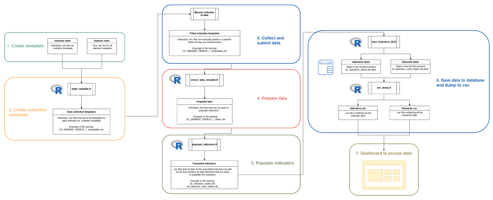

---
class: .large

# Steps 1-2: Metadata and collection templates

.pull-left[

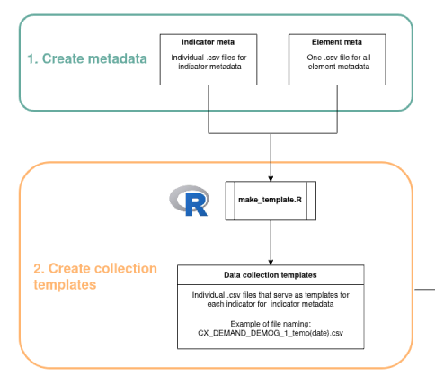
]

.pull-right[

* each indicator has its own individual `.csv` file
  
  * assists with version control & allows multiple people to work on different indicators' metadata simultaneously
  
* there is a single `.csv` file containing all the data elements

  * ensures there is no unnecessary duplication of data elements
  
* format of the indicator and metadata elements `.csvs` must be kept constant

* `make_template.R` creates one `.csv` collection template per indicator (easy assignment of collection)

]

---
class: .large

# Steps 3-5: Collect, submit, prepare, and populate

.pull-left[

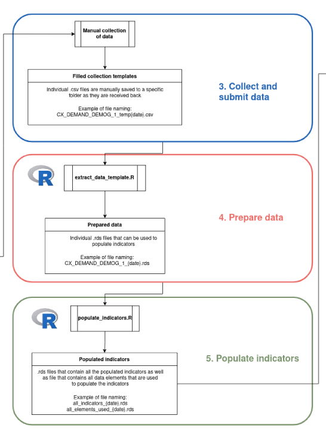
]

.pull-right[
* collection templates are filled in manually and saved in a specific location on the server
  
  * saved with a ***specific*** naming convention

  * converted to `.rds` format to facilitate downstream processing using the `extract_data_template.R` script
  
*  the `populated_indicators.R` script contains a function that reads in the converted data and populates all of the indicators

  * this scripts transforms the metadata from sentences into `code`
]

---
class: .large

# Steps 6-7: Save and disseminate

.pull-left[

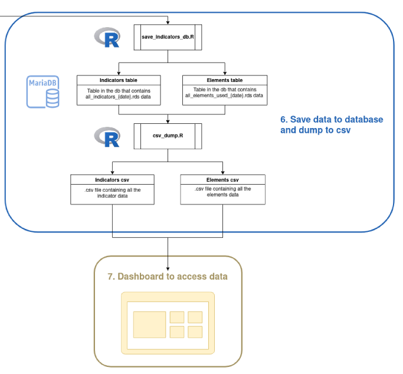
]

.pull-right[
* prepared and populated data is saved in a database

  * ensures everyone is always looking at the *same* version of the data
  
  * database is kept up to date by means of a script scheduler (`crontab`) that runs through the pipeline on a regular basis

* data from database is written to `.csv` files that are used to populate the dashboard

  * dashboard is kept up to date by means of a script scheduler
  
  * this setup affords development of an API further down the line

]


---
class: .large

# Why do we need metadata?

* Transparency and reproducibility

> Everyone knows what the indicator is measuring and should be able to produce the same value when using the same dataset. This reduces uncertainty during both the data collection and data dissemination stages.

* Automation

> Unfortunately, we are error-prone and populating indicators by hand in Excel will lead to mistakes. Once developed, metadata can be translated into code to minimize the occurrence of such errors. 

> Automation makes it easier to onboard new members to the team,  assisting with the longevity of the project

* Identification of data needs

> Metadata documents and formalizes data collection requirements and can inform engagement strategies that aim to realize efficiencies during data collection (templates, APIs, etc.)

---
class: clear, no_number, transition, .small

# Developing metadata

---
class: .large

# Start with a framework

The hardest part is to start from scratch - no indicators, no elements, just an idea of what data you possess / what is out there.

> A metadata framework can help to guide you to what indicators you need - it assists with identifying indicators of interest (i.e. coming up with indicator names). Once you have a name, you can define it.

> A good framework can also show you which indicators are unnecessary

* This project will make use of the MSI metadata framework developed by CAHF, Reall, and 71point4

  * housing focus makes it ideal for this project

* All indicators must be developed within this framework

  * this means that the indicator metadata developed by the KNBS must contain the same fields as that contained in the MSI metadata

---
class: .large

# The MSI framework

> The [MSI framework](https://housingfinanceafrica.org/documents/market-shaping-indicators-for-housing-metadata-document/) classifies 115 indicators into three tiers - categories, sub-categories, and components

* Each category has specific sub-categories

* Each sub-category has specific components

> There are two categories: Value Chain (89 indicators) and Context (26 indicators)

* Value Chain sub-categories: Land and Infrastructure, Construction and Investment, Sales and Rental, Maintenance and Management
  * 16 components

* Context sub-categories: Enabling Environment, Economic Environment, Demand
  * 3 components


---
class: .large

# MSI indicators as per the three-tier framework
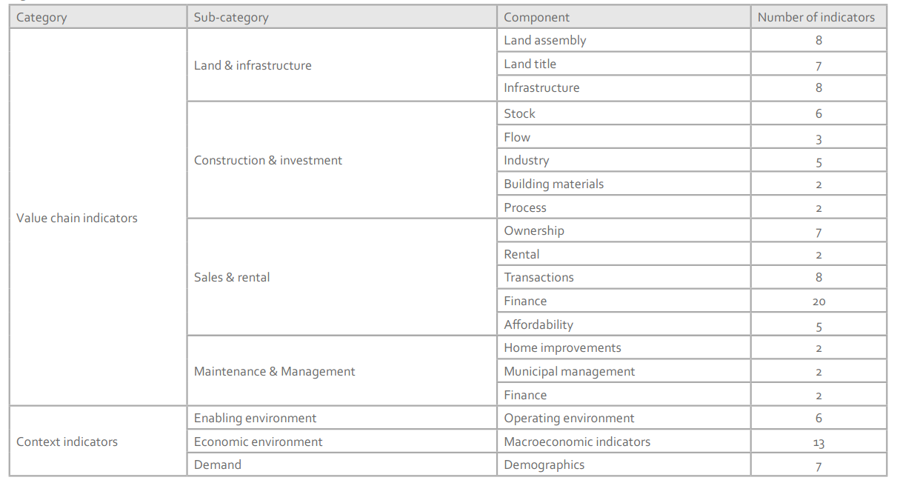

---
class: .large
# MSI indicators as per the three-tier framework

.pull-left[
* The three tiers help to focus efforts

* This makes it easier to develop indicators of interest (not a blank slate anymore)

* Also easier to identify gaps 

  * Where are we thin on indicators?
]


.pull-right[

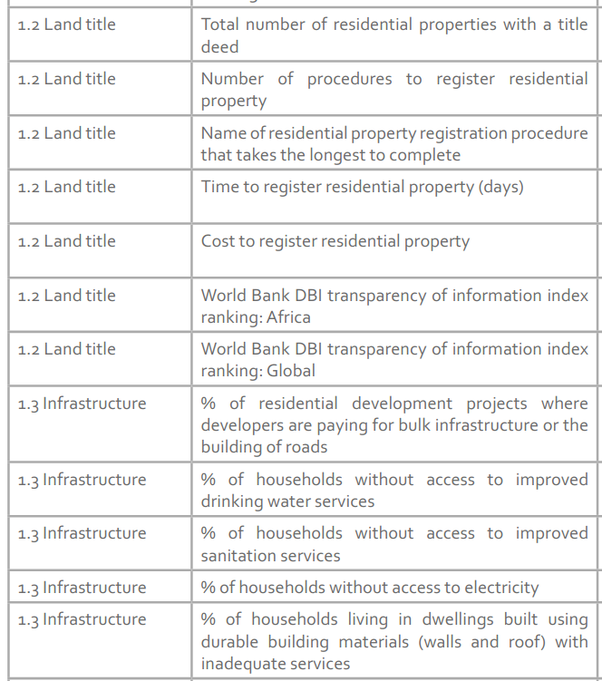
]


---
class: .large

# What makes an indicator?

**1. It is derived from one or more data elements**

Every indicator is made up of at least one data element. If it is made up of one data element, then the indicator and the element will have the same value. 

.pull-left[

```{r, include=TRUE}
tibble(Indicator = c("Number of building works completed"),
       `Number of data elements` = c("??")) %>% 
  kable()
```
]

.pull-right[
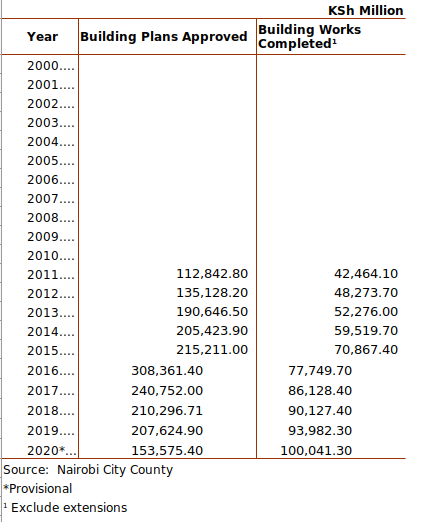
]

---
class: .large

# What makes an indicator?

**1. It is derived from one or more data elements**

Every indicator is made up of at least one data element. If it is made up of one data element, then the indicator and the element will have the same value. 

.pull-left[

```{r, include=TRUE}
tibble(Indicator = c("Number of building works completed"),
       `Number of data elements` = c("1")) %>% 
  kable()
```

]

.pull-right[

]

---
class: .large

# What makes an indicator?

**1. It is derived from one or more data elements**

.pull-left[
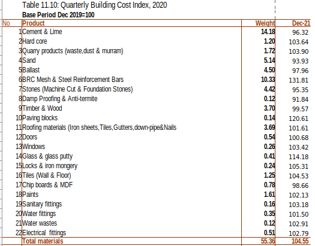
]
.pull-right[
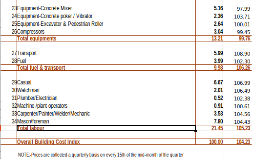
]

```{r, include=TRUE}
tibble(Indicator = c("Quarterly building cost index"),
       `Number of data elements` = c("??")) %>% 
  kable()
```

---
class: .large

# What makes an indicator?

**1. It is derived from one or more data elements**

.pull-left[

]
.pull-right[

]

```{r, include=TRUE}
tibble(Indicator = c("Quarterly building cost index"),
       `Number of data elements` = c("1 / 8 / 64")) %>% 
  kable()
```

---
class: .large

# What makes an indicator?

**1. It is derived from one or more data elements**

> Data elements differ from indicators in that we collect data elements, but we populate indicators - the elements are the micro and the indicators the macro, the indicator is the objective, its elements are the means

* Because indicators are a composite of data elements, we require much of the same metadata for data elements as we do for indicators
  
* Therefore, when developing metadata, you need to simultaneously develop the indicator metadata as well as the data element metadata
  
  * We advise on having a single `data_elements_metadata.csv` field for the data elements metadata
  
  * One `.csv` file per indicator for the indicator metadata
    * This allows one person to 'own' the development of an indicator's metadata without running into version control issues


---
class: .large

# What makes an indicator?

**2. It has a name**

The indicator name should be reasonably short, but with enough detail that users know what it is trying to measure.

> We denote indicator names with the `indicator_name` field and data element names with the `data_element_name` field

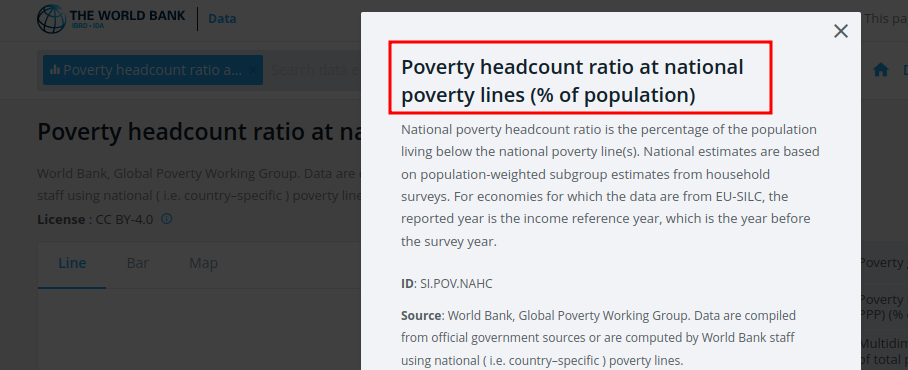

---
class: .large

# What makes an indicator?

**3. It has a key**

The indicator key serves as the unique identifier for each indicator. This field is useful for automation and ensuring everyone is talking about the same indicator - sentences can get confusing

> We denote indicator keys with the `indi_key` field and data element keys with the `de_key` field

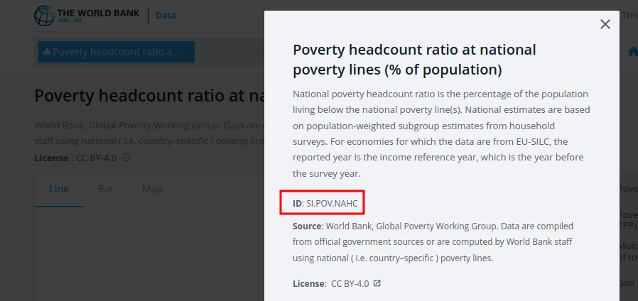

---
class: .large

# What makes an indicator?

**4. It has a definition**

As far as is possible, the indicator definition should dispel any uncertainty around what the indicator measures and what it doesn't measure. Be as explicit as you can here. 

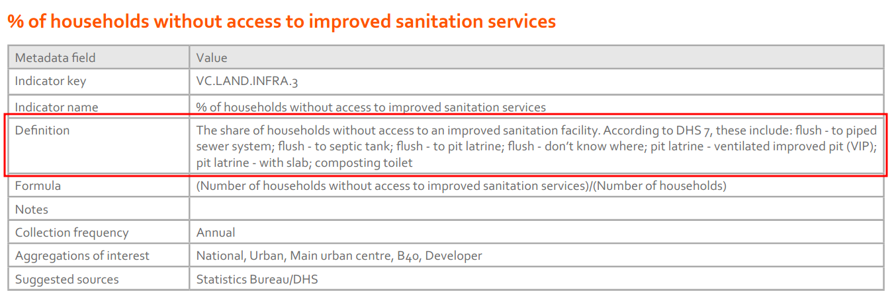

---
class: .large

# What makes an indicator?

**5. A formula *may* be required to derive it**

Indicators composed of multiple elements will require a formula to be derived. This metadata field captures that formula and is critical for accurate translation of the metadata to `code`.

> Use the keys of the *data elements* to contextualize the formula. This will make it easier down the line to translate the formula into `code`

<br>

```{r, include=TRUE}
tibble(indi_key = "KNBS_CONS_9",
       indicator_name = "Quarterly building cost index",
       definition = "The Residential and Non Resdential building cost index as reported by CIPI. Base period Dec 2019 = 100.",
       de_key = "CON_9; CON_10, CON_11; CON_12; CON_13; CON_14; CON_15; CON_16",
       formula = "(CON_9 x CON_10) + (CON_11 x CON_12) + (CON_13 x CON_14) + (CON_15 x CON_16)") %>% 
  kable %>% 
  kableExtra::kable_styling(font_size = 12)
```

---
class: .large

# What makes an indicator?

**5. A formula *may* be required to derive it**

> The `data_elements_metadata.csv` can be used to understand the formula in more detail if required

<br>

```{r, include=TRUE}
tibble(de_key = c("CON_9", "CON_10", "CON_11", "CON_12"),
       data_element_name = c(
         "Building cost total materials index",
         "Building cost total materials weight",
         "Building cost total equipments index",
         "Building cost total equipments weight"
                             ),
       definition = c(
         "The Residential and Non Resdential building cost index value for the Total materials component as reported by CIPI. Base period Dec 2019 = 100.",
         "The Residential and Non Resdential building cost weight value for the Total materials component as reported by CIPI. Base period Dec 2019 = 100.",
         "The Residential and Non Resdential building cost index value for the Total equipments component as reported by CIPI. Base period Dec 2019 = 100.",
         "The Residential and Non Resdential building cost weight value for the Total equipments component as reported by CIPI. Base period Dec 2019 = 100."
                      ),
       formula = c("", "", "", "")) %>% 
  kable() %>% 
  kableExtra::kable_styling(font_size = 14)
```


---
class: .large

# Additional metadata to be developed by the KNBS

The following additional metadata fields must also be developed by the KNBS. ***NOTE*** that they are for the indicator metadata only.

* `aggregation`

  * This field indicates the level of aggregation at which the indicator is to be calculated: National, Urban, Main urban centre, B40
  * Multiple values are possible and should be separated using the `;` delimiter

* `notes`

  * Additional notes to assist with understanding the context of the indicator, how the data it requires can be collected, how to overcome difficulties with data availability, etc – **not needed for all indicators**

* `category`, `sub-category`, `component`

  * MSI framework three-tier classification levels that the indicator relates to

---
class: .large

# Indicator metadata template

Based on the above, the indicator metadata template will have the following fields

```{r, include=TRUE}
tibble(`Metadata field` = c("indi_key",
                            "indicator_name",
                            "definition",
                            "de_key",
                            "formula",
                            "aggregation",
                            "notes",
                            "category",
                            "sub_category",
                            "component"
),
Meaning = c("Unique identifier of the indicator",
            "Short name of the indicator - should provide good indication of what it is measuring",
            "Detailed definition of the indicator - the more the better!",
            "The unique identifiers of the data elements used to populate the indicator",
            "Explains how the data elements that make up an indicator are combined to derive the indicator – not completed for all indicators",
            "Aggregation at which the indicator is calculated: National, Urban, Main urban centre, B40",
            "Notes to assist with understanding the context of the indicator, how the data it requires can be collected, how to overcome difficulties with data availability, etc – not needed for all indicators",
            "MSI framework top-tier classification that the indicator relates to",
            "MSI framework second-tier classification that the indicator relates to",
            "MSI framework third-tier classification that the indicator relates to"
            )) %>% 
  kable() %>% 
  kableExtra::kable_styling(font_size = 14)
```

---
class: .large

# Indicator metadata template

An example metadata file for the indicator associated with `indi_key = KNBS_CONS_9` is provided below 
  
  * The naming convention for the indicator metadata files are: `<indi_key>.csv`
  
  * For this example the file name would be `KNBS_CONS_9.csv`

```{r}

tibble(indi_key = "KNBS_CONS_9",
       indicator_name = "Quarterly building cost index",
       definition = "The Residential and Non Resdential building cost index as reported by CIPI. Base period Dec 2019 = 100.",
       de_key = "CON_9; CON_10, CON_11; CON_12; CON_13; CON_14; CON_15; CON_16",
       formula = "(CON_9 x CON_10) + (CON_11 x CON_12) + (CON_13 x CON_14) + (CON_15 x CON_16)",
       aggregation = "National",
       notes = "",
       category = "Value Chain",
       sub_category = "Construction and investment",
       component = "Building materials") %>% 
  kable %>% 
  kableExtra::kable_styling(font_size = 12)
```


---
class: .large

# Data element template

The data element metadata template has fewer fields than the indicator metadata template - an example is provided below

  * There is just one data element metadata file containing all of the data elements
  
  * This file should be named `data_element_metadata.csv`

```{r, include=TRUE}
tibble(de_key = c("CON_9", "CON_10", "CON_11", "CON_12"),
       data_element_name = c(
         "Building cost total materials index",
         "Building cost total materials weight",
         "Building cost total equipments index",
         "Building cost total equipments weight"
                             ),
       definition = c(
         "The Residential and Non Resdential building cost index value for the Total materials component as reported by CIPI. Base period Dec 2019 = 100.",
         "The Residential and Non Resdential building cost weight value for the Total materials component as reported by CIPI. Base period Dec 2019 = 100.",
         "The Residential and Non Resdential building cost index value for the Total equipments component as reported by CIPI. Base period Dec 2019 = 100.",
         "The Residential and Non Resdential building cost weight value for the Total equipments component as reported by CIPI. Base period Dec 2019 = 100."
                      ),
       formula = c("", "", "", "")) %>% 
  kable() %>% 
  kableExtra::kable_styling(font_size = 14)
```


---
class: .large


# Metadata checklist

* Create the metadata template for indicators and elements

* Fill in template

  * What is the name of the indicator?

  * Where does it fit in the framework? 
    
    * assign tier 1, 2, 3

  * What elements are required to generate it?

    * Are any of them already in the elements sheet? - if not, then develop it's metadata first in `data_element_metadata.csv`
  
  * Are multiple elements required? If yes then fill in the formula using the `de_keys` of its data elements
    
  * What aggregations are available?
    
* Review metadata for errors

---
class: clear, no_number, transition, .small

# What happens next?

---
class: .large

# Data collection template
 
Once the metadata is complete, we can start collecting the data. 

> The data collection templates can be generated automatically by leveraging the standardized metadata formats, i.e. we can write a script to create the data collection templates.

  * These will be output as `.csv` files
  
  * There will be one `.csv` file per indicator
  
> Having one `.csv.` file per indicator improves the efficiency of the data collection efforts

We will provide you with this script and will explain it in more detail during the second workshop.

* It is not necessary to write or change this script if the metadata formats are adhered to


---
class: .large

# Automated indicator population example

* You need to know some basic `R` and `tidyverse`

  * We will be writing functions to automatically populate the indicators

* First we check that everything we need is available

```{r, echo=TRUE, eval=FALSE}
## CX.DEMAND.DEMOG.1 ------------------------------------------------------​
if (indi_key == "CX.DEMAND.DEMOG.1") {

    check_all_elems <- unique(df$de_key)

    if(any(is.na(df$value))) {
      indi_df <- "Missing values"
    }

    if(check_all_elems != "DE.1" || length(check_all_elems) != 1 || length(df$de_key) >1){
      indi_df <- "Incorrect data element or multiple data elements provided"
    }
```

---
class: .large

# Automated indicator population example

Then we populate the indicators

```{r, echo=TRUE, eval=FALSE}
if(check_all_elems == "DE.1" && length(df$de_key) == 1 && !any(is.na(df$value))){
      indi_df <- tibble(
        indi_key = indi_key,
        aggregation = aggregation,
        year = df$year,
        value = df$value,
        source_dataset = df$source_dataset,
        collection_note = df$collection_note,
        url = df$url
      )
      na_cols <- names(which(sapply(indi_df, function(x) any(is.na(x)))))
      warning(glue("The following columns have NA values - check your input data frame: {na_cols}"))
    }

  return(indi_df)
```


---
class: .large

# What do you need?

* RStudio on your computer - [installation instructions](https://www.rstudio.com/products/rstudio/download/)

  * R and RStudio are open source software for statistical programming
  
  * We will be writing scripts together to automate the population of the indicators

* Complete [this free tidyverse course](https://github.com/rstudio-education/welcome-to-the-tidyverse)

  * Tidyverse is a collection of R software packages
  
  * These packages encapsulate a programming philosophy that is reasonably easy to pick-up
  
  * We will be using these packages to develop the scripts needed to populate the indicators

* Complete chapters 17 to 21 of of R for Data Science - [available here](https://r4ds.had.co.nz/program-intro.html)

  * This book is a great introduction to using R for Data Science
  
  * Chapters 17 - 21 introduce users to writing functions - we will be using these to automate the data pipeline


