```{r setup, include=F}
library(tidyverse)
library(knitr)
library(glue)
library(emo)

knitr::opts_chunk$set(
  echo = FALSE,
  message = FALSE,
  warning = FALSE,
  fig.width = 6,
  fig.height = 5,
  fig.align='center',
  # cache = TRUE
  cache = FALSE
  )

# pagedown::chrome_print('Sessions/01-Intro/Slides/01-01-Intro.html')

# Machines
# t3.medium
```


```{r functions, include=F}
emoji <- function(keyword){
  candidates <- emo::ji_keyword[[keyword]]
  name <- candidates[1]
  return(emo::ji_name[[name]])
}
```


class: clear, no_number, title-slide
background-image: url(templates/KNBS_title.png)
background-size: cover

# <br> KENYA AFFORDABLE HOUSING DATA PROJECT <br> <em> Technical Workshop: Day 1

---
class: clear, agenda

<!-- # 1) About Course <br> 2) Understanding Data Science Teams <br> 3) Software Requirements <br> 4) Something <br> 5) Something <br> 6) Something -->
# 1) Introduction <br> 2) About this workshop <br> 3) RStudio and Tidyverse <br> 4) Introduction to R <br> 5) Data manipulation <br> 6) Loops

---
class: clear, no_number, transition, .small

# Introduction

---
class: .large
# Who am I?

.pull-left[

* **Name** 
> Abri de Beer

* **Occupation** 
> Data Scientist at 71point4

* **Education** 
> BEng from NWU <br> MEng from NWU <br> MIT from UP

]

.pull-right[

* **Want to know more?**
> Have a look at my LinkedIn: www.linkedin.com/in/abridebeer

<br>


]

---
class: clear, no_number, transition

# About this workshop

---
class: .large
# What this workshop aims to achieve

* Upskill all participants to understand code used in the data pipeline 
> **The training only aims to serve as a foundation for participants' R coding journey**

* Familiarisation with data pipeline
> **Although not all of the participants will be working on the data pipeline on a day to day basis, understanding what happens in the pipeline is of great value to all people involved**

---
class: .large

# Key outcomes

.pull-left[

Following the workshop, we want the KNBS team to:

* Have a basic understanding of the **R code** used in the data pipeline

* Understand the **flow** of the data pipeline

* Be able to add **new indicators** to the data pipeline

]

<!-- We also encourage the following behaviour when it comes to completing the exercises: -->
.pull-right[
***PLEASE***:

* Ask questions, we've been down this road before! `r emoji("nerd")`
  
]

---
class: .large

# Asking for assistance
.pull-left[
<br>
<br>

]

.pull-right[
<br>
<br>
* Please feel free to stop me and ask a question

* If you feel more comfortable asking questions in writing feel free to email them to **abri@71point4.com**

* Help each other out! Some might be further along their data journeys than others
]

<!--  -->


---
class: clear, no_number, transition

# RStudio setup

---
class: .large

# Installing RStudio

* RStudio on your computer - [installation instructions](https://www.rstudio.com/products/rstudio/download/)

<br>
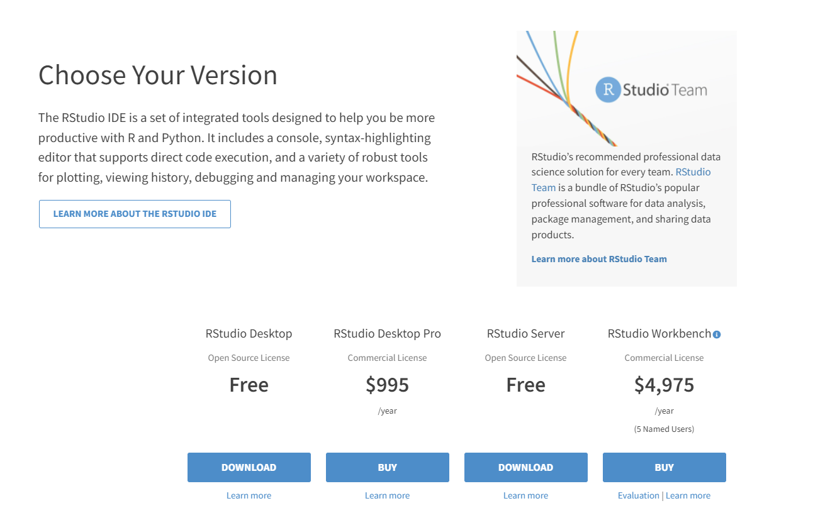

---
class: clear, no_number, transition, .small

# Introduction to R

---
class: .large

# Understanding the terminology

* R vs RStudio
> **R and RStudio are two distinctly different applications that serve different purposes. R is the software that performs the actual instructions. It’s the workhorse. Without R installed on your computer or server, you would not be able to run any commands. RStudio is a software that provides a nifty interface to R. It’s sometimes referred to as an Integrated Development Environment (IDE). Its purpose is to provide bells and whistles that can improve your experience with the R software.**

<!-- Source: https://mgimond.github.io/ES218/R_vs_RStudio.html -->
<br>
<br>

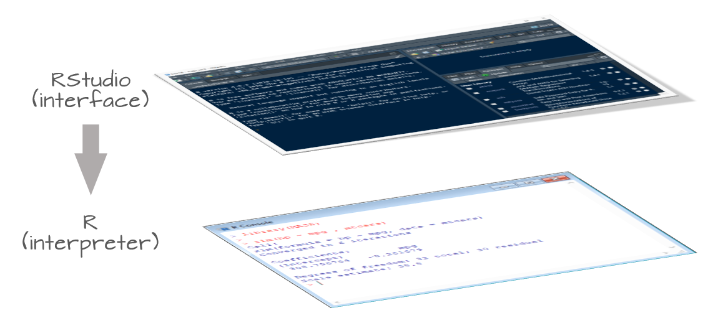
---
class: .large

# Understanding the teminology

* RStudio Desktop vs RStudio Server
> **RStudio Desktop is an R IDE that works with the version of R you have installed on your local Windows, Mac OS X, or Linux workstation. RStudio Workbench and RStudio Server are Linux server applications that provide a web-browser-based interface to the version of R running on the server.**

<!-- Source: https://support.rstudio.com/hc/en-us/articles/217799198-What-is-the-difference-between-RStudio-Desktop-RStudio-Workbench-and-RStudio-Server- -->

<br>
<br>

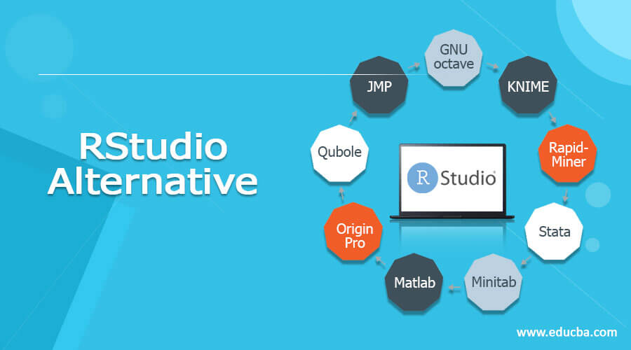

---
class: .large
# What is the tidyverse?


.footnote[
_ Art by [Allison Horst](https://github.com/allisonhorst/stats-illustrations)_
]

---
class: .large
# What is the tidyverse?

> The tidyverse is an opinionated collection of R packages designed for data science. All packages share an underlying design philosophy, grammar, and data structures.

This collection contains some of the most used libaries that an `R` data scientist will use on a daily basis. The most used packages are probably `dplyr` and `ggplot`. Today we gonna explore the _basics_ of the `dplyr` package.

.pull-left[
* `dplyr` is the grammar of data manipulation (`select`, `filter`, `group_by`, `mutate`)
* `ggplot` is the grammar of graphics - beyond the scope of this workshop (useful resources: [R for Data Science](https://r4ds.had.co.nz/) and [ggplot2](https://ggplot2-book.org/))
]

.pull-right[

]

---
class: .large
# What is the tidyverse?

Although we only going to be learning the basics of the tidyverse universe, there is A LOT more to explore in terms of the power of programming languages like `R` (and `Python`).

We recommend R for data analyses due to its firm pedigree in statistical analysis. `Python` is getting better at manipulating data with packages like `pandas` and alike, while `R` has become a more general language over the last few years. 

Even though `python` does offer some nice integration features,  `R` offers a much better ecosystem that supports reproducible research and data analysis (`Rmarkdown`, `blogdown`, `targets` etc. ).

Also, once you grasp the fundamentals of programming, it is very easy to learn another language if it is better suited towards what you want to achieve. 

---
class: .large
# Rstudio recap

The console give you a place to execute commands written in R.

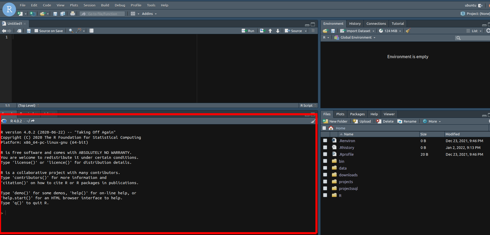

---
class: .large
# Rstudio recap

Rstudio also provides a _file explorer_ which allows users to navigate the folders easily.

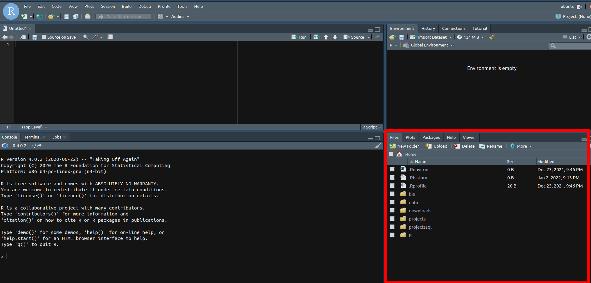

---
class: .large
# Rstudio recap

Once we start _assiging_ outputs to objects, they will appear in the environment window.

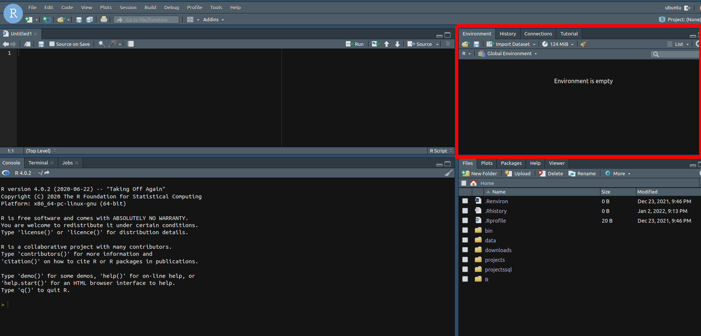

---
class: .large
# Rstudio recap

Lastly, and most importantly, we want to write scripts that we can rerun at a later time.
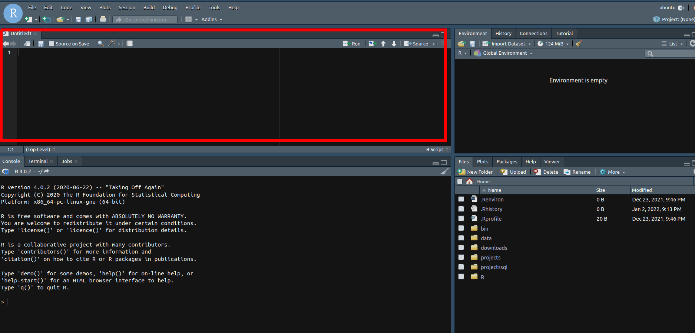
---
class: large
# Using Projects

Seemless collaboration and reporducibilty requires us to keep all of our _notes_, _scripts_, _data_ and _output_ in one single place. Why? 

Rstudio makes it easy by creating a project. 

Start by creating a folder in your `home` directory called `projects` and starting a project called `learning_dplyr`.

* Next click on the menu: 

- `File > New Project > Existing Directory`

---
class: large
# Using Projects

Using the file browser, you should see the following screen below:

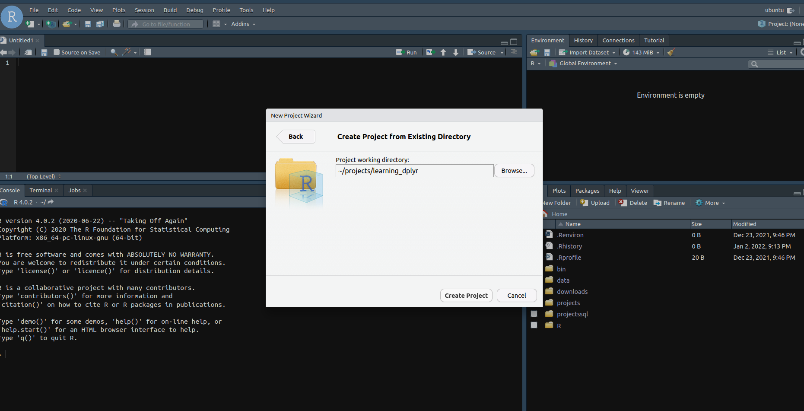


---
class: large
# Side note: using Rmarkdown for analysis

.pull-left[
* Rmarkdown allows you to write code and text together in one document - this is a great tool for reproducibility

* Rmakrdown is not covered in this workshop, but participants are encouraged to review  [R Markdown: The Definitive Guide](https://bookdown.org/yihui/rmarkdown/)

* Start by opening a new _Rmarkdown_ file (`.rmd`) in your `learning_dplyr  project` and call it `dplyr_lesson.Rmd`
]

.pull-right[
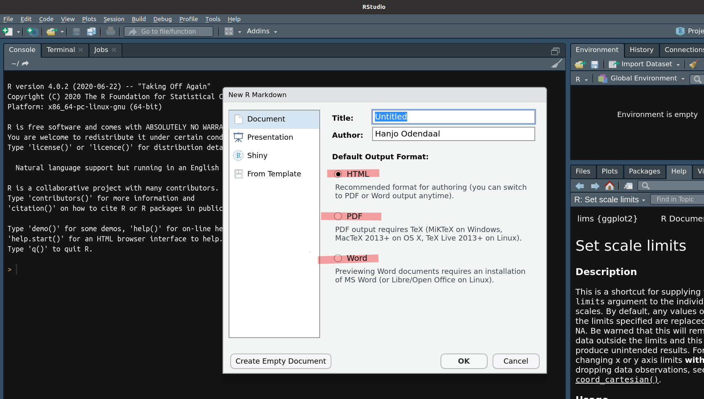
]


---
class: large

# Side note: using Rmarkdown for analysis

Lets make it look nice by changing the `yaml` at the top:

```{yml, echo=TRUE}
---
title: "Your title here"
date: "Todays date"
output: 
  html_document:
    theme: journal
    highlight: espresso
    toc: true
    toc_depth: 4
    toc_float: true
    code_folding: show
---
```

Now, very important, lets set the default settings for the document:

```{r, echo=TRUE, eval=FALSE}
knitr::opts_chunk$set(echo = TRUE, eval = FALSE)
```

---
class: large

# Side note: using Rmarkdown for analysis

> Rmarkdown can render outputs in `html`, `pdf`, `docx` and `ppt`

* Outputs are rendered by *knitting* the document - this can either be done through the GUI or by typing `ctrl` + `shift` + `k`

* Try it out on the default template!

---
class: .large

# Useful terminlogy for workshop

* **Package**
  * In R, the fundamental unit of shareable code is the package. A package bundles together code, data, documentation, and tests, and is easy to share with others. 
  * Comprehensive R Archive Network, or **CRAN**, is the public clearing house for R packages.
  
<!-- Source: https://r-pkgs.org/intro.html- -->  
<br>

* **Pipe operator**
  * The pipe operator is a special operational function available under the magrittr and dplyr package (basically developed under magrittr), which allows us to pass the result of one function/argument to the other one in sequence. It is generally denoted by symbol %>% in R Programming.
  
  * Keyboard shortcut: `ctrl` + `shift` + `m`
  
  * Note you can view all keyboard shortcuts with: `alt` + `shift` + `k` 
  
  * Shortcuts can be modified through the **Tools** menu at the top of your RStudio IDE

<!-- Source: https://www.analyticssteps.com/blogs/using-pipe-operator-simplify-your-code-r-programming- -->

---
class: .large

# Useful terminlogy for workshop

* **Function**
  * In R, a function is an object so the R interpreter is able to pass control to the function, along with arguments that may be necessary for the function to accomplish the actions

<!-- Source: https://www.tutorialspoint.com/r/r_functions.htm#:~:text=In%20R%2C%20a%20function%20is,be%20stored%20in%20other%20objects. -->

<br>

* **Assign**
  * To do useful and interesting things in R, we need to assign values to objects. To create an object, we need to give it a name followed by the assignment operator <-, and the value we want to give it.
  
  * Keyboard shortcut: `alt` + `-` (dash)
  
<!-- Source: https://cengel.github.io/R-intro/gettingstarted.html -->

---
class: .large

# Useful terminlogy for workshop

* **Loop**
  * A `loop` is a control statement that allows multiple executions of a statement or a set of statements. The word 'looping' means cycling or iterating.

<!-- Source: https://www.geeksforgeeks.org/loops-in-r-for-while-repeat/#:~:text=In%20R%20programming%2C%20we%20require,looping'%20means%20cycling%20or%20iterating. -->

<br>

* **Apply**
  * `apply` functions are a family of functions in base R which allow you to repetitively perform an action on multiple chunks of data. An apply function is essentially a loop, but run faster than loops and often require less code.

<!-- Source: https://ademos.people.uic.edu/Chapter4.html -->

---
class: .large

# Useful terminlogy for workshop

.pull-left[

* **Map**
  * The `map` functions transform their input by applying a function to each element of a list or atomic vector and returning an object of the same length as the input. A map function is a more elegant version of a loop (requires less code therefore less room for error)

<!-- Source: https://purrr.tidyverse.org/reference/map.html#:~:text=map.Rd,same%20type%20as%20the%20input. -->

<br>

* **Joins**
  * We can merge two data frames in R by using the join of functions.

]
.pull-right[
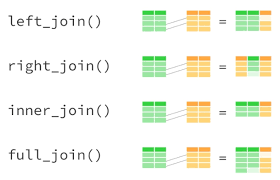
]
  
---
class: .large

# Useful terminlogy for workshop

* **If statements**
  * It is one of the easiest decision-making statements. It is used to decide whether a certain statement or block of statements will be executed or not i.e if a certain condition is true then a block of statement is executed otherwise not.
  
<!-- Source: https://www.geeksforgeeks.org/r-if-statement/#:~:text=It%20is%20one%20of%20the,execute%20if%20condition%20is%20true%20%7D -->  

<br>

* **Scripts**
  * A script is simply a text file containing a set of commands and comments. The script can be saved and used later to re-execute the saved commands. The script can also be edited so you can execute a modified version of the commands.
  
  * Keyboard shortcut: `ctrl` + `shift` + `n`
  
  * Comments in R  scripts are preceded by the `#` (pound/hastag) symbol
  
<!-- Source: http://mercury.webster.edu/aleshunas/R_learning_infrastructure/R%20scripts.html -->  

---
class: .large

# Projects in R

.pull-left[
* **What is a project?**
  * A project is simply a working directory designated with a `.RProj` file. When you open a project (using File/Open Project in RStudio or by double–clicking on the `.Rproj` file outside of R), the working directory will automatically be set to the directory that the `.RProj` file is located in.
<!-- Source: https://bookdown.org/ndphillips/YaRrr/projects-in-rstudio.html -->  
* **Why use projects?**
  * Eliminates early-stage hassle and confusion around reading in and exporting data. Setting up a working directory properly also helps build up good habits that are conducive to reproducible analysis.
  
<!-- Source: https://www.r-bloggers.com/2020/01/rstudio-projects-and-working-directories-a-beginners-guide/ -->  
]
.pull-right[

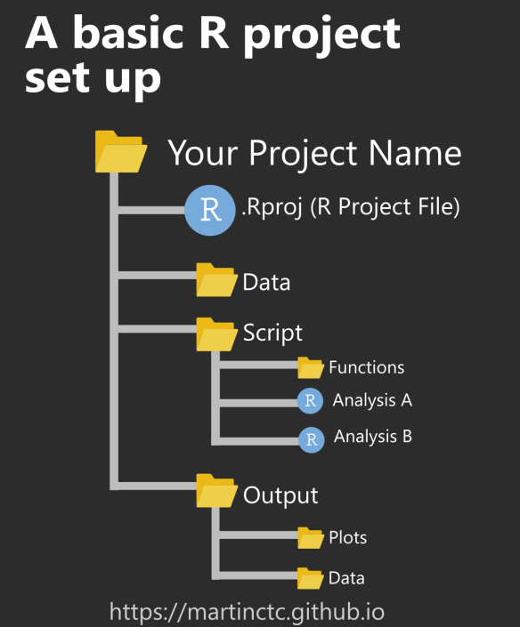
]


---
class: clear, no_number, transition, .small

# Data manipulation

---
class: large

# Manipulating objects with dplyr


.footnote[
_Art by [Allison Horst](https://github.com/allisonhorst/stats-illustrations)_
]


---
class: large

# Manipulating objects with dplyr

We can use the `dplyr` library to manipulate the data using very basic functions:

.pull-left[
* `select`: Selects specific columns by name.
* `filter`: Filter data based on certain criteria.
* `mutate`: Create a new column.
* `group_by`: Column to aggregate on.
* `summarise`: How do you want to summarise the data?
]

.pull-right[

In `R` we gonna _chain_ these commands using whats called the `pipe` operator: `%>%`. The shortcut to print this symbol is: `Ctrl + Shift + m`. 

> We read this `%>%` symbol as: _and then_

* So for instance `mtcars %>% select(mpg)` reads in english as: Take object `mtcars` _and then_ select column `mpg`.

* Another would be `mtcars %>% filter(mpg < 22)` : Take object `mtcars` _and then_ filter out rows where `mpg` is more than 22.

]

---
class: large

# select()

Extract columns by name: `select(.data, ...)`

```{r, echo=TRUE, eval=FALSE}
mtcars %>% select(mpg, cyl, disp)
```

We can also use smart selectors:

```{r, echo=TRUE, eval=FALSE}
iris %>% select(Species, contains("Sepal"))
```

Or even ranges:

```{r, echo=TRUE, eval=FALSE}
iris %>% select(Species, Sepal.Length:Petal.Length)
```

---
class: large

# filter()


.footnote[
_ Art by [Allison Horst](https://github.com/allisonhorst/stats-illustrations)_
]

---
class: large

# filter()

What if we want to only analyze certain rows? In `dplyr` we use the `filter()` function:

```{r, echo=TRUE, eval=FALSE}
mtcars %>% filter(mpg < 22)
```

We can use multiple conditions to filter (this represents an `AND`):

```{r, echo=TRUE, eval=FALSE}
mtcars %>% filter(mpg < 22, cyl < 8, gear < 4)
```

The special function `%in%` also gets used often to specify multiple conditions:

```{r, echo=TRUE, eval=FALSE}
iris %>% filter(Species %in% c("virginica", "setosa"))
```

Its also possible to create `OR` filters using the `pipe` delimiter ("|"):

```{r, echo=TRUE, eval=FALSE}
iris %>% filter(Petal.Width > 0.2 | Sepal.Width == 3.5)
```

---
class: large


# mutate()


.footnote[
_ Art by [Allison Horst](https://github.com/allisonhorst/stats-illustrations)_
]

---
class: large

# mutate()

Often you will need to add a new column that you derive. To accomplish this using `dplyr` we use `mutate`. Lets calculate the price per carat using the `diamonds` dataset from `ggplot2`:

```{r, echo=TRUE, eval=FALSE}
diamonds %>% mutate(price_per_carat = price/carat)
```

We might also want to get the price in KSh and not USD, so lets create a `price_ksh` column:

```{r, echo=TRUE, eval=FALSE}
diamonds %>% mutate(price_ksh = price*116)
```

Another nice feature we can use is the `case_when` function inside the mutate:

```{r, echo=TRUE, eval=FALSE}
diamonds %>% 
  mutate(carat_type = case_when(
    carat < 1 ~ "less than 1 carat",
    between(carat, 1, 3) ~ "1 - 3 carats",
    TRUE ~ "more than 3 carats"
  ))
```

---
class: large

# group_by() & summarise()

We might want to run an aggregation over a certain variables to calculate means, medians, etc. 

This can be done in `R` using dplyr `group_by` and `summarise`. 

```{r, echo=TRUE}
mtcars %>% 
  group_by(cyl) %>% 
  summarise(ave_mpg = mean(mpg, na.rm = T))
```

---
class: .large

# Data manipulation exercise 1

.pull-left[
* Use the data provided to answer the following question (data_manip_ex_1_data.csv):
> **What is the average km/L achieved by cars with the same number cylinders.**

* Sub questions:
> **Rename miles per gallon (mpg) variable to kilometers per liter (kml)** <br> **Save answer as csv**

]

.pull-right[
* Variable description 

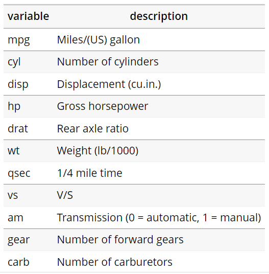
]


---
class: .large

# Hints: Data manipulation exercise 1

* **Reading csv**
```{r,echo=T, eval=FALSE}

test <- read_csv("path_to_file")

```
  
* **Grouping**
  
```{r,echo=T, eval=FALSE}

test_group <- test %>% 
  group_by(vairible_name) %>% 
  summarise(count_vairible_name = n()) %>% 
  ungroup()

```
  
---
class: .large

# Answer: Data manipulation exercise 1

* **Step 1:** Loading packages

```{r,echo=T, eval=FALSE}

library(tidyverse)

```

* **Step 2:** Reading csv

```{r,echo=T, eval=FALSE}

mtcars <- read_csv("prod_workshop/excercise/data/data_manip_ex_1_data.csv")

```


* **Step 3:** Manipulating data

```{r,echo=T, eval=FALSE}

mtcars_manip <- mtcars %>% 
  # Converting mpg to km/L
  mutate(mpg = mpg * 0.425144) %>% 
  # Renaming mpg to kml
  rename(kml = mpg) %>%
  # Select only model and kml variables
  select(model,kml)

```

---
class: .large

# Answer: Data manipulation exercise 1

* **Step 4:** Calculating averages

```{r,echo=T, eval=FALSE}

avg_kml <- mtcars_manip %>% 
  # Group by cylinder count
  group_by(cyl) %>% 
  # Summarise and get average of kml per group
  summarise(avg_kml = mean(kml)) %>%
  ungroup()

```

* **Step 5:** Saving answer

```{r,echo=T, eval=FALSE}

write_csv(avg_kml,"prod_workshop/excercise/data/ans_data_manip_ex_1.csv")

```

---
class: .large

# Data manipulation exercise 2

* Use the data provided to answer the following question (kchsp2020_annual_hh.dta):
> **Of the households that could be found what is the average number of persons per dwelling per quarter in Mombasa.**

* Sub questions:
> **Save answer as csv**

---
class: .large

# Hints: Data manipulation exercise 2

* **Reading .dta**

```{r,echo=T, eval=FALSE}

library(tidyverse)
library(haven)

test <- read_dta("path_to_file") %>% 
  as_factor() %>% 
  mutate(across(where(is.factor), as.character))

```

* **Filter**

```{r,echo=T, eval=FALSE}

test <- test %>% 
  filter(variable_name == "test")

```

---
class: .large

# Anwers: Data manipulation exercise 2

* **Step 1:** Loading packages

```{r,echo=T, eval=FALSE}

library(tidyverse)
library(haven)

```

* **Step 2:** Reading .dta

```{r,echo=T, eval=FALSE}

ken_hh <- read_dta("prod_workshop/excercise/data/kchsp2020_annual_hh.dta") %>% 
  as_factor() %>% 
  mutate(across(where(is.factor), as.character))

```

---
class: .large

# Anwers: Data manipulation exercise 2

* **Step 3:** Manipulate data

```{r,echo=T, eval=FALSE}
ken_hh_manip <- ken_hh %>% 
  # Filter to only look at households from Mombasa and where households could be found
  filter(a01 == "Mombasa" & a11_1 == "Household found") %>% 
  # Select variables to be used
  select(qrt, a12, e01) %>% 
  # Rename variables
  rename(num_person_household = a12,
         num_dwellings = e01)

```

---
class: .large

# Anwers: Data manipulation exercise 2

* **Step 4:** Calculating averages

```{r,echo=T, eval=FALSE}

avg_num <- ken_hh_manip %>% 
  # Group by quarter
  group_by(qrt) %>% 
  summarise(avg_pp_pd = mean(num_person_household/num_dwellings,na.rm = TRUE)) %>%
  ungroup()

```

* **Step 5:** Saving answer

```{r,echo=T, eval=FALSE}

write_csv(avg_num,"prod_workshop/excercise/data/ans_data_manip_ex_2.csv")

```

---
class: clear, no_number, transition, .small

# Loops

---
class: .large

# Understanding loops

* Definition:
> **A loop is a control statement that allows multiple executions of a statement or a set of statements. The word 'looping' means cycling or iterating.**

* Structure of a diffrent loops (Graphical):
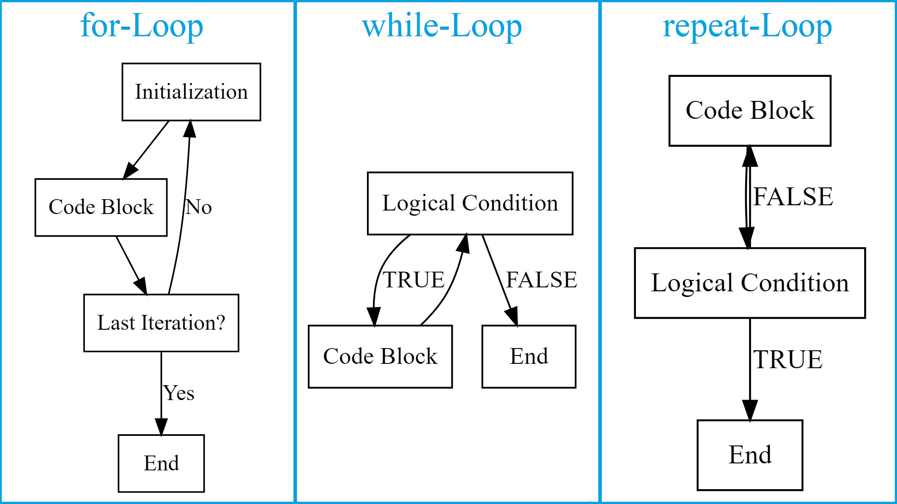
---
class: .large

# Understanding loops

* For loops in code:
```{r,echo=T, eval=FALSE}

for (i in 1:5) {
  print(i)
}

```

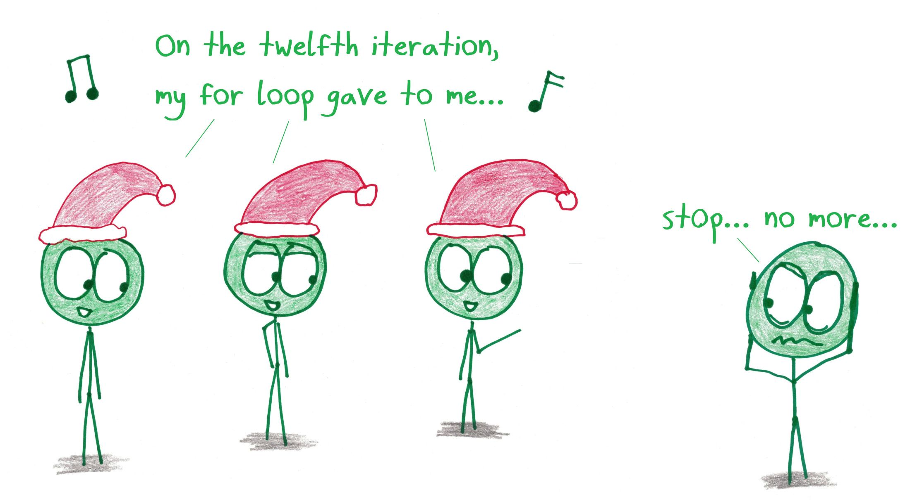


---
class: .large

# Loops exercise 1

* Use the data provided to answer the following question (loops_ex_1_data.csv):
> **Loop through data set and print the answer for Sepal.Length x Sepal.Width**

* Advanced question:
> **Loop through data set and print the answer for Sepal.Length x Sepal.Width but if answer is > 20 print "Out of bounds"**

* Variable description 


---
class: .large

# Answer: Loops exercise 1

* **Step 1:** Loading packages

```{r,echo=T, eval=FALSE}

library(tidyverse)

```

* **Step 2:** Reading csv

```{r,echo=T, eval=FALSE}

iris <- read_csv("prod_workshop/excercise/data/loops_ex_1_data.csv")

```

* **Step 3:** Loop

```{r,echo=T, eval=FALSE}

for (i in 1:nrow(iris)) {
  
  output <- iris$Sepal.Length[i]*iris$Sepal.Width[i]
  
  print(output)
  
}

```

---
class: .large

# Answer: Loops exercise 1

* **Step 4:** Advanced loop

```{r,echo=T, eval=FALSE}

for (i in 1:nrow(iris)) {
  
  output <- iris$Sepal.Length[i]*iris$Sepal.Width[i]
  
  if (output > 20) {
    
    output <- "Out of bounds"
    
  }
  
  print(output)
  
}

```

---
class: .large

# Maps vs. Loops

> Redo the loop exercise but with a map

* **Step 1:** Create a function that will perform the calculation

```{r, echo=TRUE, eval=TRUE}
sepal_function <- function(x, y){
  
  output <- x*y
  
  if (output > 20) {
    output <- "Out of bounds"
  }
  return(as.character(output))
}
```
---
class: .large

# Maps vs. Loops

> Redo the loop exercise but with a map

* **Step 2:** Map the function over the `iris` dataset

```{r, echo=TRUE}
iris %>% 
  mutate(sepal_product = map2_chr(Sepal.Length, Sepal.Width, sepal_function)) %>% 
  as_tibble() %>% 
  slice(1:5)
```


---
class: clear, no_number, transition

# Fin

