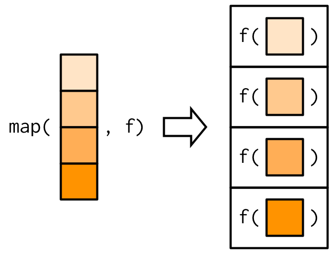

```{r setup, include=F}
library(tidyverse)
library(knitr)
library(glue)
library(emo)

knitr::opts_chunk$set(
  echo = FALSE,
  message = FALSE,
  warning = FALSE,
  fig.width = 6,
  fig.height = 5,
  fig.align='center',
  # cache = TRUE
  cache = FALSE
  )

# pagedown::chrome_print('Sessions/01-Intro/Slides/01-01-Intro.html')

# Machines
# t3.medium
```


```{r functions, include=F}
emoji <- function(keyword){
  candidates <- emo::ji_keyword[[keyword]]
  name <- candidates[1]
  return(emo::ji_name[[name]])
}
```


class: clear, no_number, title-slide
background-image: url(templates/KNBS_title.png)
background-size: cover

# <br> KENYA AFFORDABLE HOUSING DATA PROJECT <br> <em> Technical Workshop: Day 2

---
class: clear, agenda

<!-- # 1) About Course <br> 2) Understanding Data Science Teams <br> 3) Software Requirements <br> 4) Something <br> 5) Something <br> 6) Something -->
# 1) Joins <br> 2) Functions

---
class: clear, no_number, transition, .small

# Joins

---
class: .large
# More about joins?

* **Definition**
  * We can merge two data frames in R by using the join of functions.
  
* **Different joins**
  * Natural join or Inner Join: To keep only rows that match from the data frames, specify the argument all=FALSE.
  * Full outer join or Outer Join: To keep all rows from both data frames, specify all=TRUE.
  * Left outer join or Left Join: To include all the rows of your data frame x and only those from y that match, specify x=TRUE.
  * Right outer join or Right Join: To include all the rows of your data frame y and only those from x that match, specify y=TRUE.
  
<br>


---
class: .large
# More about joins?

* **Joins vs binds**
  * **Join** uses a conman id variable to combine two data sets.
  * **Bind** does not make use of common id variable.
    * Row bind = rbind()
    * Coloum bind = cbind()
<br>
    

 

 

---
class: .large
# Joins exercise 1

* Use the data provided to answer the following question (joins_ex_1_1_data.csv & joins_ex_1_2_data.csv):
> **Inner join the data** <br> **Outer join the data** <br> **Left join the data** <br> **Right join the data**
    


---
class: .large

# Hints: Joins exercise 1

* **Inner join**

```{r,echo=T, eval=FALSE}

test <- inner_join(df1,df2,by = c("variable_name"))

```

* **Outer join**

```{r,echo=T, eval=FALSE}

test <- full_join(df1,df2,by = c("variable_name"))

```

* **Left join**

```{r,echo=T, eval=FALSE}

test <- left_join(df1,df2,by = c("variable_name"))

```

* **Right join**

```{r,echo=T, eval=FALSE}

test <- right_join(df1,df2,by = c("variable_name"))

```

---
class: .large

# Answer: Joins exercise 1

* **Step 1:** Loading packages

```{r,echo=T, eval=FALSE}

library(tidyverse)

```

* **Step 2:** Reading csv

```{r,echo=T, eval=FALSE}

product <- read_csv("prod_workshop/excercise/data/joins_ex_1_1_data.csv")
state <- read_csv("prod_workshop/excercise/data/joins_ex_1_2_data.csv")

```

---
class: .large

# Answer: Joins exercise 1

* **Step 3:** Join data

```{r,echo=T, eval=FALSE}

# Inner join --------------------------------------------------------------

inner <- inner_join(product,state, by = c("id"))

# Outer join --------------------------------------------------------------

outer <- full_join(product,state, by = c("id"))

# Left join ---------------------------------------------------------------

left <- left_join(product,state, by = c("id"))

# Right join --------------------------------------------------------------

right <- right_join(product,state, by = c("id"))

```

---
class: .large
# Joins exercise 2

* Use the data provided to answer the following question (kchsp2020_annual_hh.dta & kchsp2020_annual_hhm.dta):
> **Calculate the number of females per house each quarter in Mombasa**

* Sub questions:
> **Save answer as csv**

<br>
    


---
class: .large

# Hints: Joins exercise 2

* **Reading .dta**

```{r,echo=T, eval=FALSE}

library(haven)

test <- read_dta("path_to_file") %>% 
    as_factor() %>% 
  mutate(across(where(is.factor), as.character))

```

* **Filter**

```{r,echo=T, eval=FALSE}

test <- test %>% 
  filter(vairible_name == "test")

```

* **Grouping**
  
```{r,echo=T, eval=FALSE}

test_group <- test %>% 
  group_by(vairible_name) %>% 
  summarise(count_vairible_name = n()) %>% 
  ungroup()

```

---
class: .large

# Hints: Joins exercise 2

* **Changing values**

```{r,echo=T, eval=FALSE}

test <- test %>% 
  mutate(vairible_name = case_when(
    vairible_name == "First" ~ 1,
    TRUE ~ NA_real_
  ))

```

---
class: .large

# Anwers: Joins exercise 2

* **Step 1:** Loading packages

```{r,echo=T, eval=FALSE}

library(tidyverse)
library(haven)

```

* **Step 2:** Reading csv

```{r,echo=T, eval=FALSE}

ken_hh <- read_dta("prod_workshop/excercise/data/kchsp2020_annual_hh.dta") %>% 
  as_factor() %>% 
  mutate(across(where(is.factor), as.character))

ken_hhm <- read_dta("prod_workshop/excercise/data/kchsp2020_annual_hhm.dta") %>% 
  as_factor() %>% 
  mutate(across(where(is.factor), as.character))

```

---
class: .large

# Anwers: Joins exercise 2

* **Step 3:** Manipulating data

```{r,echo=T, eval=FALSE}

ken_hh_manip <- ken_hh %>% 
  # Filter to only look at households from Mombasa
  filter(a01 == "Mombasa") %>% 
  # Select variables to be used
  select(qrt,clid,hhid) %>% 
  # Change format of qrt variable
  mutate(qrt = case_when(
    qrt == "First" ~ 1,
    qrt == "Second" ~ 2,
    qrt == "Third" ~ 3,
    qrt == "Fourth" ~ 4,
    TRUE ~ NA_real_
  ))

ken_hhm_manip <- ken_hhm %>% 
  # Filter to only look at households from Mombasa
  filter(a01 == "Mombasa" & b04 == "Female") %>%
  # Select variables to be used
  select(qrt,clid,hhid,b04) %>% 
  # Rename variables
  rename(sex = b04)

```

---
class: .large

# Anwers: Joins exercise 2

* **Step 4:** Calculating averages

```{r,echo=T, eval=FALSE}

full_data <- left_join(ken_hh_manip,ken_hhm_manip, by = c("qrt","clid","hhid")) %>% 
  group_by(qrt,clid,hhid) %>% 
  summarise(female_count = sum(sex == "Female"))

```

* **Step 5:** Saving answer

```{r,echo=T, eval=FALSE}

write_csv(full_data,"prod_workshop/excercise/data/ans_joins_ex_2.csv")

```

---
class: clear, no_number, transition, .small

# Functions

---
class: .large
# More about functions?

* **Definition**
  * In R, a function is an object so the R interpreter is able to pass control to the function, along with arguments that may be necessary for the function to accomplish the actions
  
* **User-defined vs built-in functions** 
  * User-defined: Defined and created by user
  * Built-in: Functions included in packages
  
<br>
    


---
class: .large
# Functions exercise 1

* Answer the following question:
> **Write a function that take 3 arguments and adds them all and prints the results**

<br>
    


---
class: .large

# Hints: Functions exercise 1

* **Coding functions**

```{r,echo=T, eval=FALSE}

function_name <- function(arg_1, arg_2, ...) {
  
   Function body

}

```

* **Calling a functions**

```{r,echo=T, eval=FALSE}

function_name(arg1, arg_2, ...)

```

---
class: .large

# Anwers: Functions exercise 1

* **Step 1:** Loading packages

```{r,echo=T, eval=FALSE}

library(tidyverse)

```

* **Step 2:** Code function

```{r,echo=T, eval=FALSE}

add_all <- function(a,b,c) {
  
  result <- a * b + c
  
  print(result)
  
}

```

* **Step 3:** Call function

```{r,echo=T, eval=FALSE}

add_all(2,3,4)

add_all(a = 2, b = 3, c = 4)

```

---
class: .large
# Mapping a function 

* **Definition**
  * The map family of functions offer an alternative to the apply functions
  
<br>
    


---
class: .large
# Functions exercise 2

* Use the data provided to answer the following question (functions_ex_2_data.csv):
> **Using a function and map create a new variable named total that adds Sepal.Length,Sepal.Width,Petal.Length,Petal.Width**

<br>
    


---
class: .large

# Hints: Functions exercise 2

* **Map functions**

```{r,echo=T, eval=FALSE}

library(purrr)

```

* **Mapping**

```{r,echo=T, eval=FALSE}

test <- test %>% 
  mutate(vairible_name = pmap(list(arg_1, arg_2, ..),function_name))

```

---
class: .large

# Answers: Functions exercise 2

* **Step 1:** Loading packages

```{r,echo=T, eval=FALSE}

library(tidyverse)
library(purrr)

```

* **Step 2:** Reading csv

```{r,echo=T, eval=FALSE}

iris <- read_csv("prod_workshop/excercise/data/functions_ex_2_data.csv")

```

* **Step 3:** Code function

```{r,echo=T, eval=FALSE}

add_all <- function(a,b,c,d) {
  
  x <- a + b + c + d
  
  return(x)
  
}

```

---
class: .large

# Answers: Functions exercise 2

* **Step 4:** Calculate total

```{r,echo=T, eval=FALSE}

total_iris <- iris %>% 
  mutate(total = pmap(list(Sepal.Length,Sepal.Width,Petal.Length,Petal.Width),add_all))

```

