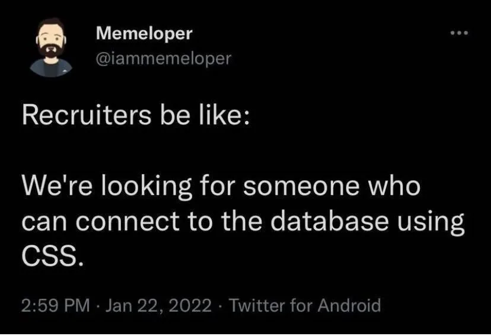
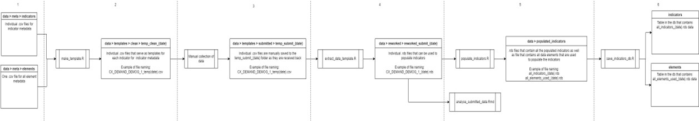

```{r setup, include=F}
library(tidyverse)
library(knitr)
library(glue)
library(emo)

knitr::opts_chunk$set(
  echo = FALSE,
  message = FALSE,
  warning = FALSE,
  fig.width = 6,
  fig.height = 5,
  fig.align='center',
  # cache = TRUE
  cache = FALSE
  )

# pagedown::chrome_print('Sessions/01-Intro/Slides/01-01-Intro.html')

# Machines
# t3.medium
```


```{r functions, include=F}
emoji <- function(keyword){
  candidates <- emo::ji_keyword[[keyword]]
  name <- candidates[1]
  return(emo::ji_name[[name]])
}
```


class: clear, no_number, title-slide
background-image: url(templates/KNBS_title.png)
background-size: cover

# <br> KENYA AFFORDABLE HOUSING DATA PROJECT <br> <em> Technical Workshop: Day 3

---
class: clear, agenda

<!-- # 1) About Course <br> 2) Understanding Data Science Teams <br> 3) Software Requirements <br> 4) Something <br> 5) Something <br> 6) Something -->
# 1) Databases <br> 2) Data managment <br> 3) KNBS Pipeline

---
class: clear, no_number, transition, .small

# Databases

---
class: .large
# Databases introduction

* **Database definition**
  * A database is an organized collection of structured information, or data, typically stored electronically in a computer system.
  
<!-- Source: https://www.oracle.com/za/database/what-is-database/ -->  
  
* **Different types of databases**
  * Hierarchical databases
  * Network databases
  * Object-oriented databases
  * Relational databases
  * NoSQL databases
  
<!-- Source: https://www.geeksforgeeks.org/types-of-databases/ --> 

---
class: .large
# Databases introduction

* **Definition of relational database**
  * A relational database organizes data into tables which can be linked—or related—based on data common to each.
  
<!-- Source: https://www.ibm.com/cloud/learn/relational-databases -->  

* **Databases vs spreadsheets**
  * Spreadsheets were originally designed for one user, and their characteristics reflect that. They’re great for a single user or small number of users who don’t need to do a lot of incredibly complicated data manipulation. Databases, on the other hand, are designed to hold much larger collections of organized information—massive amounts, sometimes. Databases allow multiple users at the same time to quickly and securely access and query the data using highly complex logic and language.
  
<!-- Source: https://www.oracle.com/za/database/what-is-database/ -->  

---
class: .large
# Databases introduction

* **What is SQL?**
  * SQL is a programming language used by nearly all relational databases to query, manipulate, and define data, and to provide access control.
  
<!-- Source: https://www.oracle.com/za/database/what-is-database/ -->   

* **What is a database management system (DBMS)?**
  * A database typically requires a comprehensive database software program known as a database management system (DBMS). A DBMS serves as an interface between the database and its end users or programs, allowing users to retrieve, update, and manage how the information is organized and optimized. A DBMS also facilitates oversight and control of databases, enabling a variety of administrative operations such as performance monitoring, tuning, and backup and recovery.
  
<!-- Source: https://www.oracle.com/za/database/what-is-database/ -->    
  
* **What is MySQL?**
  * MySQL is an open source relational database management system based on SQL. It was designed and optimized for web applications and can run on any platform.
  
<!-- Source: https://www.oracle.com/za/database/what-is-database/ --> 

---
class: .large
# Connecting to a databse through R

* **Packages**
```{r,echo=T, eval=FALSE}

library(DBI)
library(RMySQL)

```

* **Establishing connection**

```{r,echo=T, eval=FALSE}

conn <- dbConnect(
  MySQL(),
  host = "127.0.0.1",
  port = 888,
  user = username,
  password = password,
  dbname = database,
  timeout = 10
  )

```

---
class: .large
# Connecting to a databse through R

* **Query**

```{r,echo=T, eval=FALSE}

test <- dbGetQuery(conn, "SELECT * FROM mtcars")

```

<br>
    



---
class: .large
# Connecting using knbsDButils

* **Packages**

```{r,echo=T, eval=FALSE}

library(knbsDButils)

```


* **Query**

```{r,echo=T, eval=FALSE}

db_query <- function(query, db, tbl = T){
  conn <- db_connect(db)
  on.exit(dbDisconnect(conn))

  x <- dbGetQuery(conn, query)
  if(isTRUE(tbl)){
    x <- x %>% as_tibble()
  }
  return(x)
}


db_query("SELECT * FROM mtcars","db")

```

---
class: .large
# Connecting using knbsDButils

* **Write table**

```{r,echo=T, eval=FALSE}

db_write_df <- function(df, table_name, db, type = "append"){

  tmp_name <- paste0(path_home(), "/tmp/temp_table_", round(runif(1, 1, 10000)), ".csv")

  on.exit(log_info(glue("Deleting file {tmp_name}")))
  on.exit(unlink(tmp_name), add = T)

  log_info(glue("Writing to temp file: {tmp_name}"))
  vroom_write(df, tmp_name, delim = "|", na = "")

  if(file.exists(tmp_name)){
    log_info(glue("Finished writing to temp file: {tmp_name}"))
  }
  if(!file.exists(tmp_name)){
    stop(log_error("Failed writing to temp file: {tmp_name}"))
  }

```

---
class: .large
# Connecting using knbsDButils

```{r,echo=T, eval=FALSE}

if(type == "overwrite"){
    log_warn(glue("Truncating table {table_name}"))
    db_query(glue("
             TRUNCATE {table_name}
             "),
             db = db)
  }

  db_query(glue("
           LOAD DATA LOCAL INFILE '{tmp_name}'
           INTO TABLE {table_name}
           FIELDS
            TERMINATED BY '|'
           IGNORE 1 LINES
                  "),
             db = db)
}


db_write_df(df,"table_name","db")

```


---
class: clear, no_number, transition, .small

# Data managment

---
class: .large
# Introduction to data managment

* **Data management definition**
  * Data Management is the development, execution, and supervision of plans, policies, programs, and practices that
deliver, control, protect, and enhance the value of data and information assets throughout their life cycles.

<!-- Source: DMBOK 2 --> 

* **What does data management entail**
  * Data management activities are wide-ranging. They include everything from the ability to make consistent decisions about how to get strategic value from data to the technical deployment and performance of databases.
  
<!-- Source: DMBOK 2 --> 

---
class: .large
# Data managment through data pipelines
  
* **Data pipeline definition**
  * A data pipeline is a series of data processing steps. If the data is not currently loaded into the data platform, then it is ingested at the beginning of the pipeline. Then there are a series of steps in which each step delivers an output that is the input to the next step. This continues until the pipeline is complete. In some cases, independent steps may be run in parallel.
  
<!-- Source: https://hazelcast.com/glossary/data-pipeline/ -->  

* **Structure of a data pipeline**
  * Data pipelines consist of three key elements: a source, a processing step or steps, and a destination.
  
<!-- Source: https://hazelcast.com/glossary/data-pipeline/ -->  

* **Importance of a data pipeline**
  * Data pipelines, by consolidating data from all your disparate sources into one common destination, enable quick data analysis for business insights. They also ensure consistent data quality, which is absolutely crucial for reliable business insights.
  
<!-- Source: https://www.integrate.io/blog/what-is-a-data-pipeline/ -->  

---
class: .large
# Data managment through data pipelines

* **When to automate data pipeline**
  * Is data mission critical?
  * Does data come in a standard format?
  * Does automation make financial sense?
  * What is the frequency of the data?
  
* **How to automate a data pipeline**
  * CRON - Linux
  * Task Scheduler - Windows
  * Apache airflow
  * Other proprietary programs
  
---
class: .large
# KNBS pipeline

**Graphical representation of pipeline**

<br>
    


---
class: .large
# KNBS pipeline

* **Six steps of the data pipeline**
  1. Create indicator and data element metadata.
  2. Create data collection templates from indicator and data elements metadata.
  3. Manual data collection.
  4. Extract data from completed data collection templates.
  5. Populate indicators using reworked data.
  6. Save data to database.

---
class: clear, no_number, transition

# Fin
