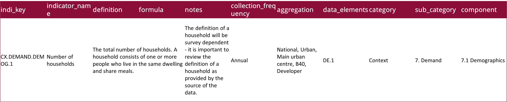
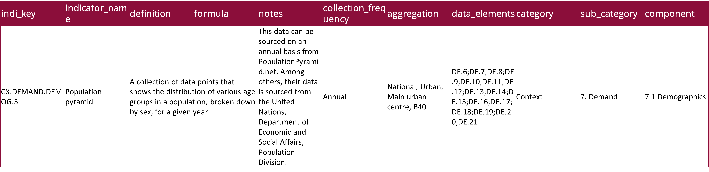
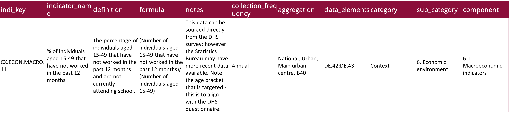

```{r setup, include=F}
library(tidyverse)
library(knitr)
library(glue)
library(emo)

knitr::opts_chunk$set(
  echo = FALSE,
  message = FALSE,
  warning = FALSE,
  fig.width = 6,
  fig.height = 5,
  fig.align='center',
  # cache = TRUE
  cache = FALSE
  )

# pagedown::chrome_print('Sessions/01-Intro/Slides/01-01-Intro.html')

# Machines
# t3.medium
```


```{r functions, include=F}
emoji <- function(keyword){
  candidates <- emo::ji_keyword[[keyword]]
  name <- candidates[1]
  return(emo::ji_name[[name]])
}
```


class: clear, no_number, title-slide
background-image: url(templates/KNBS_title.png)
background-size: cover

# <br> KENYA AFFORDABLE HOUSING DATA PROJECT <br> <em> Technical Workshop: Day 4

---
class: clear, agenda

<!-- # 1) About Course <br> 2) Understanding Data Science Teams <br> 3) Software Requirements <br> 4) Something <br> 5) Something <br> 6) Something -->
# 1) Populate indicators function <br> 2) Live code <br> 3) KNBS indicator coding

---
class: clear, no_number, transition, .small

# Populate indicators function

---
class: .large
# Populate indicators template

* **Template**

```{r,echo=T, eval=FALSE, size = 'tiny'}

# Test for indi_key
if (indi_key == "indi_key") {
    
    # Find number of distinct de_key's
    check_all_elems <- unique(df$de_key)
      
    # Test if any values are missing
    if(any(is.na(df$value))) {
      indi_df <- "Missing values"
    }
    
    # Test if all data elements required to populate indicator are included
    if(check_all_elems != "de_key" || length(check_all_elems) != 1 || length(df$de_key) >1){
      indi_df <- "Incorrect data element or multiple data elements provided"
    }
    
    # Test if all data elements required to populate indicator are included and have values
    if(check_all_elems == "de_key" && length(df$de_key) == 1 && !any(is.na(df$value))){
      
      # Create output in table
      indi_df <- tibble(
        indi_key = indi_key,
        aggregation = aggregation,
        year = df$year,
        value = df$value,
        source_dataset = df$source_dataset,
        collection_note = df$collection_note,
        url = df$url
      )
      
      # Check for NA columns
      na_cols <- names(which(sapply(indi_df, function(x) any(is.na(x)))))
      warning(glue("The following columns have NA values - check your input data frame: {na_cols}"))
    }
  
  # Return created table
  return(indi_df)
  }

```

---
class: .large
# Populate indicators example

* **Example 1: Metadata**

<br>
    

---
class: .large
# Populate indicators example

* **Example 1: Code**

```{r,echo=T, eval=FALSE}

  if (indi_key == "CX.DEMAND.DEMOG.1") {

    check_all_elems <- unique(df$de_key)

    if(any(is.na(df$value))) {
      indi_df <- "Missing values"
    }

    if(check_all_elems != "DE.1" || length(check_all_elems) != 1 || length(df$de_key) >1){
      indi_df <- "Incorrect data element or multiple data elements provided"
    }

    if(check_all_elems == "DE.1" && length(df$de_key) == 1 && !any(is.na(df$value))){
      indi_df <- tibble(
        indi_key = indi_key,
        aggregation = aggregation,
        year = df$year,
        value = df$value,
        source_dataset = df$source_dataset,
        collection_note = df$collection_note,
        url = df$url
      )
      na_cols <- names(which(sapply(indi_df, function(x) any(is.na(x)))))
      warning(glue("The following columns have NA values - check your input data frame: {na_cols}"))
    }

  return(indi_df)
  }


```


---
class: .large
# Populate indicators example

* **Example 2: Metadata**

<br>
    


---
class: .large
# Populate indicators example

* **Example 2: Code**

```{r,echo=T, eval=FALSE}

  if (indi_key == "CX.DEMAND.DEMOG.5") {

    check_all_elems <- tibble(de_key = c(
      "DE.6", "DE.7", "DE.8", "DE.9", "DE.10",
      "DE.11", "DE.12", "DE.13", "DE.14", "DE.15",
      "DE.16", "DE.17", "DE.18", "DE.19", "DE.20", "DE.21"
    )
    )

    missing_elems <- check_all_elems %>% filter(!de_key %in% df$de_key)

    if(any(is.na(df$value))) {
      indi_df <- "Missing values"
    }

    if(length(missing_elems$de_key) == length(check_all_elems$de_key)){
      indi_df <- glue("None of the data elements required to populate indicator {class(df)} have been provided.") %>%
        as.character()
    }

    if(length(missing_elems$de_key) > 0 && length(missing_elems$de_key) < length(check_all_elems$de_key)){
      indi_df <- glue("Partially completed. Missing elements: {paste0(missing_elems$de_key, collapse = ', ')}") %>%
        as.character()
    }

    if(length(missing_elems$de_key)==0 && length(df$de_key) == length(check_all_elems$de_key) && !any(is.na(df$value))){
      indi_df <- tibble(
        indi_key = indi_key,
        aggregation = aggregation,
        year = paste0(unique(df$year), collapse = "; "),
        value = "Completed",
        source_dataset = paste0(unique(df$source_dataset), collapse = "; "),
        collection_note = paste0(unique(df$collection_note), collapse = "; "),
        url = paste0(unique(df$url), collapse = "; ")
      )
      na_cols <- names(which(sapply(indi_df, function(x) any(is.na(x)))))
      warning(glue("The following columns have NA values - check your input data frame: {na_cols}"))
    }

    return(indi_df)
  }

```

---
class: .large
# Populate indicators example

* **Example 3: Metadata**

<br>
    


---
class: .large
# Populate indicators example

* **Example 3: Code**

```{r,echo=T, eval=FALSE}

  if (indi_key == "CX.ECON.MACRO.11") {

    check_all_elems <- tibble(de_key = c("DE.42", "DE.43"))

    missing_elems <- check_all_elems %>% filter(!de_key %in% df$de_key)

    if(any(is.na(df$value))) {
      indi_df <- "Missing values"
    }

    if(length(missing_elems$de_key) == length(check_all_elems$de_key)){
      indi_df <- glue("None of the data elements required to populate indicator {class(df)} have been provided.")
    }

    if(length(missing_elems$de_key) > 0 && length(missing_elems$de_key) < length(check_all_elems$de_key)){
      indi_df <- glue("Partially completed. Missing elements: {paste0(missing_elems$de_key, collapse = ', ')}")
    }

    if(length(missing_elems$de_key)==0 && length(df$de_key) == length(check_all_elems$de_key) && !any(is.na(df$value))){

      elem_42_val <- pull(df[df[, "de_key"] == "DE.42", names(df) %in% "value"]) %>% as.numeric()
      elem_43_val <- pull(df[df[, "de_key"] == "DE.43", names(df) %in% "value"]) %>% as.numeric()

      indi_df <- tibble(
        indi_key = indi_key,
        aggregation = aggregation,
        year = min(df$year),
        value = elem_42_val/elem_43_val,
        source_dataset = paste0(unique(df$source_dataset), collapse = "; "),
        collection_note = paste0(unique(df$collection_note), collapse = "; "),
        url = paste0(unique(df$url), collapse = "; ")
      )
      na_cols <- names(which(sapply(indi_df, function(x) any(is.na(x)))))
      warning(glue("The following columns have NA values - check your input data frame: {na_cols}"))
    }
    return(indi_df)
  }

```

---
class: clear, no_number, transition, .small

# Live code

---
class: clear, no_number, transition, .small

# KNBS indicator coding

